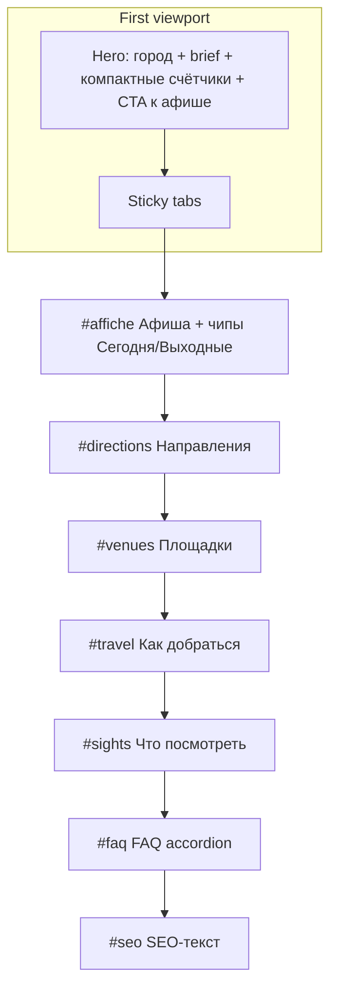

# City Hub Wireframe v1 — Фаза 1 (IA / UX)

**Статус:** согласован wireframe (без кода Lovable)  
**Дата:** 2026-07-19  
**Стек:** Next.js `apps/web`, маршрут `/cities/[slug]`  
**Контент:** `cityInfo` (`brief`, `travel`, `sights`, `faq`) + Public API city payload  
**Визуал:** светлая издательская сетка; тёмный акцент опционально только для СПб — **не в фазе 1**

---

## 1. Цели фазы 1

1. **Афиша выше** — пользователь быстрее доходит до покупки/выбора даты, не прокручивая гид.
2. **Один job на секцию** — бренд/город → навигация → афиша → гид → SEO/FAQ.
3. **Sticky-табы** — быстрый переход по якорям без «карточного дашборда».
4. **Компактные счётчики** + чипы **Сегодня / Выходные** — сигнал свежести и фильтр без тяжёлого UI.
5. **FAQ accordion** — читаемо на mobile, без стены текста.
6. Сохранить уже сделанное: locative («в Мурманске»), SEO title «на сегодня» (может ещё катиться на prod).

**Не цель фазы 1:** полный визуальный ребренд 65 хабов, dark theme, карта, bento-фото достопримечательностей.

---

## 2. Порядок секций

### Desktop

| # | Секция | Якорь | Job |
|---|--------|-------|-----|
| 0 | Site header (глобальный) | — | Навигация сайта |
| 1 | **Hero** — бренд + город | `#top` | Brand first: имя города как hero-сигнал |
| 2 | **Sticky tabs** | — | Переход по секциям |
| 3 | **Афиша** (фильтры + лента/таблица) | `#affiche` | Выбор события |
| 4 | **Направления / категории** (компактно) | `#directions` | Перелинковка landings / категории |
| 5 | **Площадки** (короткий список) | `#venues` | Переход на venue pages |
| 6 | **Как добраться** | `#travel` | Travel-текст |
| 7 | **Что посмотреть** | `#sights` | Список sights (без photo-bento) |
| 8 | **FAQ** (accordion) | `#faq` | Ответы / rich results |
| 9 | **SEO-текст** (если есть) | `#seo` | Длинный текст под афишей |
| 10 | Site footer | — | — |

### Mobile

Тот же порядок. Отличия:

- Sticky tabs: горизонтальный scroll, `position: sticky` под header.
- Hero: без боковой «панели» статистики — счётчики в одну строку под brief.
- Афиша: по умолчанию cards; table — опционально или скрыта.
- Чипы Сегодня/Выходные — сразу под sticky tabs / над фильтрами афиши.
- FAQ: только accordion (один открытый или multi — на усмотрение реализации, prefer one-open).

---

## 3. Блоки подробно

### 3.1 Hero (`#top`)

| | |
|--|--|
| **Контент** | H1 = имя города; brief из `cityInfo.brief` (fallback — шаблон с locative); breadcrumbs Главная / Город |
| **Источник** | `cityInfo.brief`; `PublicCityDto`; `inCityPrepositional` |
| **Счётчики** | Компактно: события + площадки из `payload.stats` (не крупные hero-карточки) |
| **CTA** | Primary: «События {locative}» → `#affiche`; Secondary (опц.): «Как добраться» → `#travel` |
| **Не класть** | Погода, мосты, badges/overlay-чипы, stats-strips, расписание в hero |

**Визуал:** светлый editorial; фото города допустимо как full-bleed фон с лёгким затемнением **или** без фото — типографика + brief. Не purple-gradient AI look. Cards в hero запрещены.

---

### 3.2 Sticky tabs

| Tab label | Якорь |
|-----------|-------|
| Афиша | `#affiche` |
| Направления | `#directions` |
| Площадки | `#venues` |
| Как добраться | `#travel` |
| Достопримечательности | `#sights` |
| FAQ | `#faq` |

- Sticky под глобальным header.
- Активный таб по Intersection Observer / scrollspy.
- Табы без контента (пустой travel/sights/faq) — скрывать или disabled.
- **Миграция якорей:** текущий `#city-schedule` → `#affiche` (оставить redirect/alias `#city-schedule` → `#affiche` для внешних ссылок блога). Аналогично: `#city-directions` → `#directions`, `#city-sights` → `#sights`, `#city-travel` → `#travel`, `#city-guide-faq` / `#faq` → единый `#faq`.

---

### 3.3 Афиша (`#affiche`) — приоритет фазы 1

| | |
|--|--|
| **Контент** | Список/сетка сессий города; фильтр категории/тег; режим cards \| table (desktop) |
| **Источник** | `PublicCityPageDto.sessions` (+ client filter); категории из `city.categories`; теги из sessions |
| **Чипы** | **Сегодня** / **Выходные** — client-side filter по дате сессии (TZ региона города, как на event page) |
| **CTA** | Карточка события → `/events/{slug}`; «Все» сброс фильтров |
| **Рекомендованные** | Опционально 0–6 «стоит внимания» **внутри** секции афиши (не отдельная секция выше афиши) |

**Acceptance UI:** афиша видна без длинного скролла гида; на desktop — в первом–втором экране после hero+tabs.

---

### 3.4 Направления (`#directions`)

| | |
|--|--|
| **Контент** | Landings города +/или топ категорий |
| **Источник** | `payload.landings`; `city.categories` |
| **CTA** | Landing href / scroll to `#affiche` с выставленной категорией |
| **Формат** | Текстовые/chip-ссылки или минимальные interactive tiles — **не** декоративные cards |

---

### 3.5 Площадки (`#venues`)

| | |
|--|--|
| **Контент** | Короткий список venue (имя, опц. count событий) |
| **Источник** | `payload.venues` (уже с фиксом events>0 / venues count) |
| **CTA** | → `/venues/...` или `/locations/...` |
| **Не входит** | Карта площадок, pin-cluster |

---

### 3.6 Как добраться (`#travel`)

| | |
|--|--|
| **Контент** | Прозаический travel-блок |
| **Источник** | `cityInfo.travel` |
| **CTA** | Нет (или «К афише» → `#affiche`) |
| **Скрывать** | Если travel пуст |

---

### 3.7 Что посмотреть (`#sights`)

| | |
|--|--|
| **Контент** | Список title + text (топ из cityInfo) |
| **Источник** | `cityInfo.sights` (legacy `mustSee` через resolve) |
| **CTA** | Нет обязательного; не линковать на пустые сущности |
| **Не входит** | Bento с фото, gallery, lightbox |

---

### 3.8 FAQ (`#faq`) — accordion

| | |
|--|--|
| **Контент** | Q/A пары |
| **Источник** | `cityInfo.faq` (+ при необходимости generated items из `buildCityFaqItems` / editorial) — **один** accordion-блок, без дубля «guide FAQ» + «SEO FAQ» как сейчас |
| **CTA** | Нет |
| **Формат** | Accordion; JSON-LD FAQPage без регрессии |

---

### 3.9 SEO-текст (`#seo`)

| | |
|--|--|
| **Контент** | Длинный SEO paragraph |
| **Источник** | `buildCitySeoText` / `seoText` prop |
| **Позиция** | После FAQ или сразу перед FAQ — предпочтительно **после** FAQ, чтобы FAQ был выше для UX |
| **Скрывать** | Если null |

> В таблице порядка выше: FAQ → SEO. Допустимо SEO → FAQ, если SEO критичен для crawl; UX-приоритет — FAQ выше.

---

## 4. Что НЕ входит в фазу 1

| Отложено | Почему |
|----------|--------|
| Погода / развод мостов | Отдельный data-контур, clutter в hero |
| Bento с фото sights | Контент/ассеты, не IA |
| Карта площадок | Geo UI + perf |
| Полный dark redesign всех 65 хабов | Scope explosion |
| Тёмный акцент СПб | Опционально позже, A/B на одном городе |
| Lovable / внешний redesign-код | Согласовано: только wireframe → реализация в `apps/web` |
| Новые API (кроме date-filter на клиенте) | Фаза 1 = layout + IA |

---

## 5. Критерии готовности (acceptance)

### Документ / согласование

- [x] Wireframe v1 записан и согласован (этот файл)
- [ ] Ссылка на файл в Tasktracker / Diary

### Реализация (фаза 1 code — отдельно, после wireframe)

- [ ] Порядок секций: hero → sticky tabs → **affiche раньше гида**
- [ ] Якоря `#affiche`, `#directions`, `#venues`, `#travel`, `#sights`, `#faq` (+ aliases старых hash)
- [ ] Sticky tabs работают desktop + mobile; пустые секции не в табах
- [ ] Чипы Сегодня / Выходные фильтруют sessions корректно по TZ
- [ ] FAQ — один accordion; без двойного FAQ-блока
- [ ] Счётчики компактные; hero без clutter
- [ ] Locative + SEO «на сегодня» без регрессии
- [ ] Светлая сетка; нет purple AI look; cards только у interactive (event cards, filters)
- [ ] Smoke: ≥2 slug (напр. `murmansk`, `moscow`) — View Source + scrollspy + фильтры
- [ ] Внешние ссылки блога на `#city-schedule` по-прежнему скроллят к афише

---

## 6. Оценка объёма (T-shirt)

| Кусок | Size | Комментарий |
|-------|------|-------------|
| IA reorder + якоря + aliases | **S** | Перестановка секций в `CityPageView` |
| Sticky tabs + scrollspy | **M** | Mobile sticky + a11y |
| Чипы Сегодня/Выходные | **S–M** | Date logic + TZ |
| FAQ accordion unify | **S** | Схлопнуть два FAQ |
| Hero compact stats / light editorial polish | **S** | Без полного редизайна токенов |
| **Фаза 1 целиком** | **M** | ~1–2 eng-дня при фокусе; без Lovable |

**Вне фазы:** dark/SPb accent / map / bento = **L+** отдельно.

---

## 7. Связанные артефакты

- Контент-матрица: [city-hub-content-gaps.md](./city-hub-content-gaps.md)
- Трекер: P.2 / P.2e в [Tasktracker.md](./Tasktracker.md)
- Текущая реализация: `apps/web/src/components/CityPageView.client.tsx`
- Контент: `apps/web/src/lib/cityInfo.ts`

---

## 8. Changelog

| Дата | Изменение |
|------|-----------|
| 2026-07-19 | v1: согласованный wireframe фазы 1 (без кода Lovable) |
