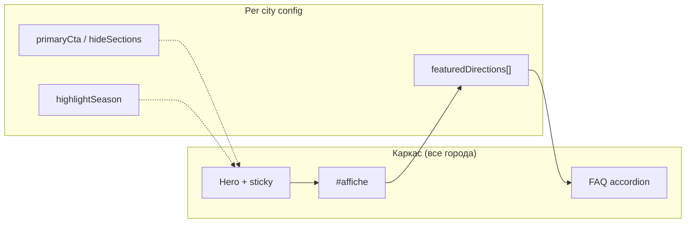

# City Hub Wireframe v2 — Фаза 2 (city-specific IA)

**Статус:** согласован wireframe (без реализации кода)  
**Дата:** 2026-07-19  
**Стек:** Next.js `apps/web`, маршрут `/cities/[slug]`  
**База:** [city-hub-wireframe-v1.md](./city-hub-wireframe-v1.md) (фаза 1: афиша выше, sticky, FAQ accordion, чипы Сегодня/Выходные)  
**Контент:** `cityInfo` / будущий `cityHubConfig` + Public API (`landings`, sessions, venues)  
**Визуал:** светлая издательская сетка; различия городов — через **контент и порядок секций**, не через 65 уникальных CSS-тем

---

## 1. Цели фазы 2

1. **City-specific, не копипаста** — 65 хабов делят один каркас, но набор направлений, сезонный акцент, featured landing и порядок/скрытие секций задаются **per city**.
2. **Плитки направлений** — `#directions` становится главным city-fingerprint: видимый набор landings/категорий, характерный для города (не одинаковый чип-ряд «экскурсии / театр / …» на всех).
3. **Усиление афиши** — после фазы 1: recommended внутри `#affiche`, чипы Сегодня/Выходные, опционально deep-link с направления → фильтр афиши.
4. **Sights → афиша только при реальной привязке** — CTA «события рядом / по теме» только если есть matching sessions/landings; иначе sight остаётся редакционным текстом без фальшивой ссылки.
5. **Площадки топ-N без карты** — короткий ranked list (имя + count), без geo-UI.
6. Сохранить совместимость с v1: якоря, sticky tabs, locative, SEO «на сегодня», светлая сетка.

**Не цель фазы 2:** погода/мосты, bento-фото, карта, dark theme СПб, полный визуальный ребренд 65 хабов.

---

## 2. Принцип city-specific

### 2.1 Общее (каркас — один для всех хабов)

| Слой | Что одинаково |
|------|----------------|
| Маршрут / SEO shell | `/cities/[slug]`, breadcrumbs, title/description templates, JSON-LD |
| Порядок-по-умолчанию | Hero → sticky tabs → **афиша** → направления → площадки → travel → sights → FAQ → SEO |
| Якоря | `#affiche`, `#directions`, `#venues`, `#travel`, `#sights`, `#faq` (+ aliases v1) |
| Компоненты | Sticky tabs, chips Сегодня/Выходные, FAQ accordion, event cards/table |
| Правила пустых секций | Нет данных → секция и таб скрыты |
| Визуальный язык | Светлый editorial; cards только у interactive (events, filters, direction tiles) |

### 2.2 Уникально per city

| Ось | Примеры влияния |
|-----|-----------------|
| **Набор направлений** | СПб: речные / дворцы / мосты; Сочи: пляж / Красная Поляна; Казань: Кремль / Татарстан |
| **Акцент сезона** | Белые ночи / навигация; бархатный сезон; Курултай/лето; полярная ночь / сияние |
| **Featured landing** | Один «флагман» в hero secondary CTA или первая плитка направлений |
| **Порядок / скрытие секций** | Город без сильных sights → `#sights` ниже или hide; Москва — venues выше из-за масштаба |
| **Primary CTA copy** | «Круизы по Неве» vs «На Красную Поляну» vs «События в Москве» — не один шаблон |
| **Редакционный brief / FAQ** | Уже в `cityInfo`; фаза 2 не дублирует, а **связывает** с направлениями и афишей |

> Тест копипасты: если после замены H1 город «не узнаётся» по блоку направлений и CTA — конфиг недостаточен.

---

## 3. Конфиг-идея (IA only, без кода)

Расширить `cityInfo` **или** ввести рядом `cityHubConfig` (рекомендация IA: отдельный объект рядом с `CITY_INFO`, чтобы не смешивать прозу и layout-флаги).

### 3.1 Предлагаемые поля

```ts
// Идея контракта — не реализация
type CityHubConfig = {
  /** Плитки направлений: порядок = порядок UI; slug/href → landings API или category filter */
  featuredDirections: Array<{
    id: string;           // стабильный ключ
    label: string;        // «Речные прогулки», «Красная Поляна»
    href?: string;        // /landings/... или /events?city=&category=
    landingSlug?: string; // матч payload.landings
    categoryKey?: string; // фильтр афиши #affiche
    emphasis?: 'primary' | 'default';
  }>;

  /** Короткий сезонный сигнал (chip / subtitle под brief) — не виджет погоды */
  highlightSeason?: {
    label: string;        // «Белые ночи», «Бархатный сезон»
    monthsHint?: string;  // «май–июль» (текст, не live calendar)
  };

  /** Скрыть секции каркаса, если city-job не требует */
  hideSections?: Array<'directions' | 'venues' | 'travel' | 'sights' | 'seo'>;

  /** Переопределение primary CTA в hero (по умолчанию → #affiche) */
  primaryCta?: {
    label: string;
    target: '#affiche' | '#directions' | string; // string = landing href
  };

  /** Опционально: порядок секций после афиши (если отличается от default) */
  sectionOrderAfterAffiche?: Array<'directions' | 'venues' | 'travel' | 'sights'>;
};
```

### 3.2 Источники и fallback

| Поле | Источник | Fallback |
|------|----------|----------|
| `featuredDirections` | Конфиг + матч `payload.landings` | Топ категорий города / первые N landings по API |
| `highlightSeason` | Конфиг (редакция) | Не показывать chip |
| `hideSections` | Конфиг | Показывать, если есть данные |
| `primaryCta` | Конфиг | «События {locative}» → `#affiche` |
| brief / travel / sights / faq | `cityInfo` (уже есть) | Шаблоны v1 |

**Правило:** конфиг **курирует**, API **валидирует**. Плитка без живого landing/сессий → не рендерить (или disabled), чтобы не плодить 404.

---

## 4. Примеры различий (не шаблон)

### Санкт-Петербург

| | |
|--|--|
| **Fingerprint** | Вода, дворцы, белые ночи / навигация |
| **featuredDirections** | Речные прогулки → дворцы/Петергоф → музеи → развод мостов (landing/blog soft-link, не live widget) |
| **highlightSeason** | «Белые ночи» (май–июль) или «Навигация» |
| **primaryCta** | «Круизы и прогулки» → featured river landing **или** `#directions` |
| **Секции** | `#directions` сразу после афиши; `#sights` богат — оставить; dark theme **не** в фазе 2 |

### Сочи

| | |
|--|--|
| **Fingerprint** | Море + горы |
| **featuredDirections** | Пляж/набережная → Красная Поляна → парки/океанариум → вечерние шоу |
| **highlightSeason** | «Бархатный сезон» / «Горный сезон» (по редакционному приоритету) |
| **primaryCta** | «На Красную Поляну» или «События в Сочи» → `#affiche` |
| **Секции** | Travel важен (аэропорт/трансфер) — не hide |

### Казань

| | |
|--|--|
| **Fingerprint** | Кремль, Татарстан, семейный культурный туризм |
| **featuredDirections** | Казанский Кремль / остров-град → татарская кухня/этно → семейные → вечерние круизы по Казанке (если есть landings) |
| **highlightSeason** | Летние фестивали / Курултай (текстовый акцент, не календарь API) |
| **primaryCta** | «События в Казани» → `#affiche`; secondary → featured Kremlin landing |
| **Секции** | Sights с привязкой к афише **только** если есть matching events |

### Мурманск

| | |
|--|--|
| **Fingerprint** | Север, сияние, выезды (Териберка) |
| **featuredDirections** | Северное сияние / арктические туры → Териберка → городские события |
| **highlightSeason** | «Сезон сияния» (текст) |
| **primaryCta** | «События в Мурманске» → `#affiche` (каталог тоньше — не раздувать фейковыми плитками) |
| **Секции** | `hideSections` возможен для пустых направлений; venues топ-N даже при малом N |

### Москва

| | |
|--|--|
| **Fingerprint** | Масштаб каталога |
| **featuredDirections** | Театр → концерты → экскурсии → семейные / парки (по реальным landings + топ categories) |
| **highlightSeason** | Опционально слабо; масштаб важнее сезона |
| **primaryCta** | «События в Москве» → `#affiche` |
| **Секции** | `#venues` можно поднять сразу после `#directions` (`sectionOrderAfterAffiche`); афиша — главный job |



---

## 5. Секции фазы 2 (детали + данные)

Порядок по умолчанию — как в v1. Фаза 2 **углубляет** отмеченные секции.

### 5.1 Hero (`#top`) — дельта фазы 2

| | |
|--|--|
| **Добавить** | Опциональный chip `highlightSeason`; `primaryCta` из конфига |
| **Источник** | `cityInfo.brief` + `cityHubConfig.primaryCta` / `highlightSeason` |
| **Не класть** | Погода, развод мостов live, badges-overlay, stats-strips |

### 5.2 Sticky tabs

Как в v1. Табы для `hideSections` и пустых секций — не показывать. Если `sectionOrderAfterAffiche` меняет порядок — labels tabs следуют видимому порядку.

### 5.3 Афиша (`#affiche`) — усиление

| | |
|--|--|
| **База v1** | Список sessions; cards/table; чипы Сегодня/Выходные |
| **Фаза 2** | Recommended 0–6 внутри секции; deep-link с direction tile → preselect category/tag; empty-state с CTA на `#directions` если фильтр пуст |
| **Источник** | `PublicCityPageDto.sessions`, `city.categories`, tags; TZ региона города |

### 5.4 Направления (`#directions`) — **главная дельта фазы 2**

| | |
|--|--|
| **Контент** | Плитки `featuredDirections` (interactive tiles: label + опц. count) |
| **Источник** | `cityHubConfig.featuredDirections` ⋈ `payload.landings` (+ fallback categories) |
| **CTA** | Landing page **или** scroll `#affiche` + filter |
| **Формат** | Компактные interactive tiles (одна job: выбор направления). Не декоративный card-grid «как у конкурентов» |
| **City-specific** | Состав и порядок **обязательно** отличаются между fingerprint-городами; generic fallback — только если конфиг пуст |

### 5.5 Площадки (`#venues`) — топ-N без карты

| | |
|--|--|
| **Контент** | Топ-N venue по count событий (N конфигурируемо, default 8–12); имя + count |
| **Источник** | `payload.venues` (уже с fix events>0 / venues) |
| **CTA** | → `/venues/...` |
| **Не входит** | Карта, pin-cluster, «все на карте» |

### 5.6 Как добраться (`#travel`)

Без изменения IA v1. Источник: `cityInfo.travel`. Может быть в `hideSections` только если пусто или редакция явно скрыла.

### 5.7 Что посмотреть (`#sights`) — привязка к афише

| | |
|--|--|
| **Контент** | Список sights (title + text) |
| **Источник** | `cityInfo.sights` / `mustSee` |
| **CTA фазы 2** | Ссылка «События / билеты» **только** при реальной привязке: matching landing slug, category, или sessions по эвристике (явный `eventSlugs` / `landingSlug` в будущем расширении sight — опционально) |
| **Запрет** | Кнопка «Купить» на каждый sight без матча; bento-фото |

### 5.8 FAQ + SEO

Как в v1: один accordion; SEO после FAQ. Источники: `cityInfo.faq`, `buildCitySeoText`.

---

## 6. Что НЕ входит (фаза 3+)

| Отложено | Фаза |
|----------|------|
| Погода / развод мостов (live или near-live) | **3** |
| Bento-фото достопримечательностей / gallery | **3** |
| Карта площадок | **3** |
| Dark accent / dark redesign СПб | **3** |
| 65 уникальных визуальных тем | никогда как цель; только конфиг + контент |
| Lovable / внешний redesign-код | вне scope; реализация в `apps/web` |
| Новые backend API ради фазы 2 | не требуется; конфиг + существующие landings/sessions |

---

## 7. Критерии готовности (acceptance)

### Документ / согласование

- [x] Wireframe v2 записан (этот файл)
- [ ] Ссылка в Tasktracker / Diary (P.2g)

### Реализация (фаза 2 code — P.2h, отдельно)

- [ ] Каркас v1 на месте (или параллельно после P.2f)
- [ ] `featuredDirections` (или эквивалент) рендерит плитки; порядок/набор различаются ≥ на 5 fingerprint-городах (СПб, Сочи, Казань, Мурманск, Москва)
- [ ] Fallback без конфига не ломает остальные ~60 хабов
- [ ] Плитка без живого landing/данных не ведёт в 404
- [ ] `highlightSeason` / `primaryCta` / `hideSections` работают по контракту (пустые = no-op)
- [ ] Афиша: recommended + deep-link с направления
- [ ] Sights→афиша только при реальной привязке
- [ ] Venues: топ-N, **без** карты
- [ ] Нет элементов фазы 3 (погода, bento, карта, dark СПб)
- [ ] Smoke: 5 fingerprint slug + 1 «тонкий» хаб (fallback)

---

## 8. Оценка объёма (T-shirt)

| Кусок | Size | Комментарий |
|-------|------|-------------|
| Контракт `cityHubConfig` + resolve/merge с landings | **M** | Типы + fallback |
| Плитки `#directions` + deep-link в афишу | **M** | UI + filter state |
| Контент fingerprint (5 городов) | **S–M** | Редакция/IA заполнение |
| `highlightSeason` + `primaryCta` + `hideSections` | **S** | |
| Sights conditional CTA | **S–M** | Правила матчинга |
| Venues top-N polish | **S** | Без карты |
| Остальные хабы на fallback | **S** | Не блокирует ship fingerprint |
| **Фаза 2 целиком** | **M–L** | ~2–4 eng-дня после готовности v1 layout; без фазы 3 |

**Зависимость:** логично после или внахлёст с P.2f (реализация v1). Wireframe v2 = docs only.

---

## 9. Связанные артефакты

- Фаза 1: [city-hub-wireframe-v1.md](./city-hub-wireframe-v1.md)
- Контент-матрица: [city-hub-content-gaps.md](./city-hub-content-gaps.md)
- Трекер: P.2g / P.2h в [Tasktracker.md](./Tasktracker.md)
- Реализация: `apps/web/src/components/CityPageView.client.tsx`
- Контент: `apps/web/src/lib/cityInfo.ts` (+ будущий config)

---

## 10. Changelog

| Дата | Изменение |
|------|-----------|
| 2026-07-19 | v2: wireframe фазы 2 — city-specific направления, конфиг IA, out of scope = фаза 3 |
